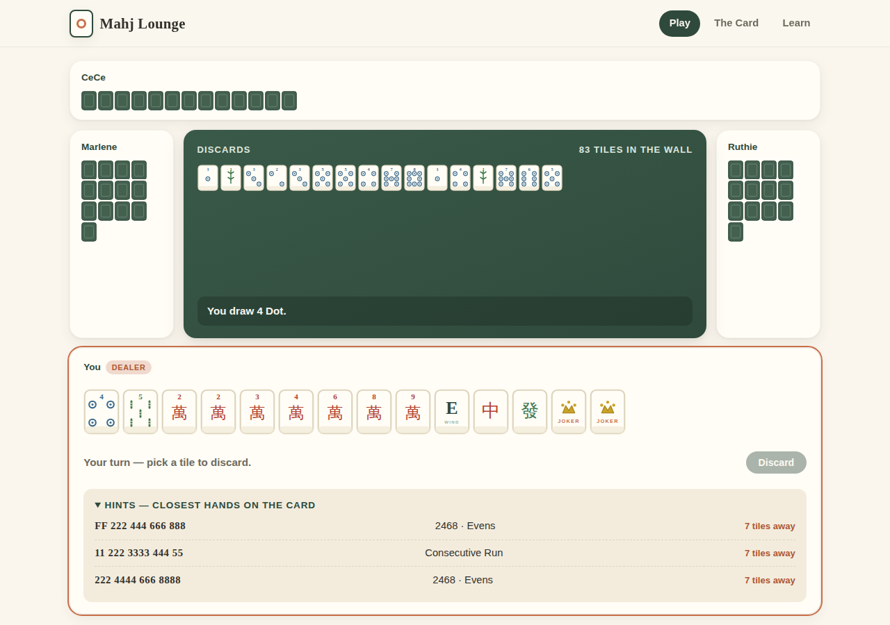

# 🀄 Mahj Lounge

**American Mahjong, beautifully.** A clean, modern, open-source web app for playing
American (NMJL-style) Mahjong in your browser — the Charleston, the jokers, the card,
and three friendly bots. No app, no ads, no account.



## Features

- **Full American rules engine** — the real 152-tile set (dots, bams, craks, winds,
  dragons, 8 flowers, 8 jokers), a proper Charleston (first, optional second, courtesy
  pass), discard calling for pungs/kongs/quints, joker redemption from exposures,
  concealed hands, and wall games.
- **An original card** — *The Lounge Card, No. 1*: 26 hands across nine sections
  (Year, Evens, Like Numbers, Consecutive Run, Odds, Winds & Dragons, 369, Quints,
  Singles & Pairs). The official NMJL card is copyrighted, so the Lounge ships its own
  card in the same spirit — free forever.
- **Three bot opponents** — Ruthie, CeCe, and Marlene chase real card hands, call
  discards, and redeem jokers.
- **Learn as you play** — a built-in hint panel shows the closest hands on the card and
  how many tiles away you are, plus a five-minute [Learn](#) page for newcomers.
- **Zero backend** — a fully static site. The whole game runs in your browser.

## Quick start

```bash
cd mahj-lounge
npm install
npm run dev      # local dev server
npm test         # engine test suite (incl. full seeded game simulations)
npm run build    # typecheck + production build to dist/
```

## Deploying

The repo ships a GitHub Actions workflow (`.github/workflows/deploy-mahj-lounge.yml`)
that tests, builds, and publishes the app to **GitHub Pages** on every push to the
default branch. One-time setup: in the repository settings, set
**Settings → Pages → Source → GitHub Actions**. The site serves at
`https://<owner>.github.io/<repo>/`.

Hosting somewhere else? The build is plain static files — set the base path and drop
`dist/` anywhere:

```bash
VITE_BASE=/ npm run build   # e.g. for a custom domain
```

## How the engine works

Everything lives in `src/engine/`, UI-free and fully testable:

| Module | What it does |
| --- | --- |
| `tiles.ts` | The 152-tile deck, tile ids, shuffling, sorting |
| `card.ts` | The Lounge Card as declarative patterns (suit variables, runs, dragons), expanded into concrete tile requirements |
| `match.ts` | Scoring a rack against every hand, exact win validation (jokers only in groups of 3+), legal claim discovery |
| `game.ts` | The state machine: deal → Charleston → turns → claims → mahjong |
| `ai.ts` | Bot policy: chase the hand with the fewest missing tiles |

## Roadmap

- Live multiplayer tables (play with your actual group)
- Scoring extras: jokerless bonuses, dealer rotation, running scores across hands
- Editable/custom cards, including importing your club's house card
- Accessibility pass and mobile-first table layout

## Contributing

Warmly welcome! Good first contributions: new hands for the card (add a pattern in
`src/engine/card.ts` — the test suite validates it totals 14 tiles), smarter bot
defense, or UI polish. Please keep `npm test` and `npm run build` green.

## Legal

MIT licensed — see [LICENSE](LICENSE). Mahj Lounge is not affiliated with, or endorsed
by, the National Mah Jongg League. The included card is an original work; no NMJL card
content is reproduced.
